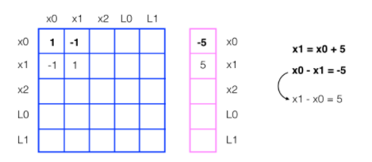
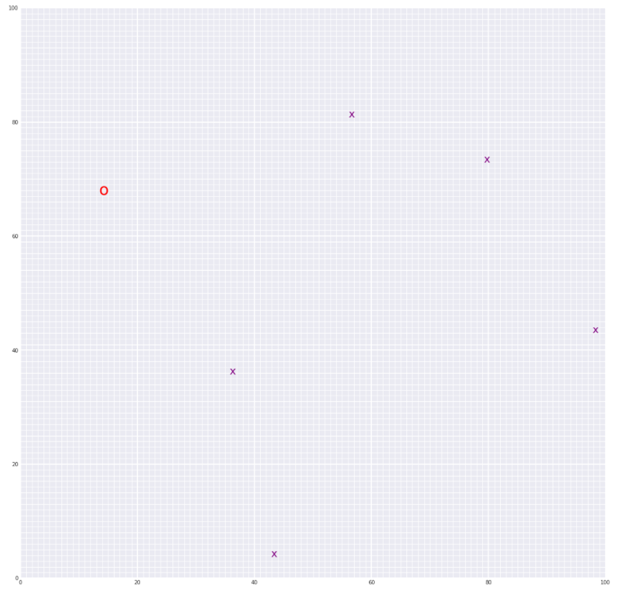

# Simultaneous Localization and Mapping ([SLAM](https://en.wikipedia.org/wiki/Simultaneous_localization_and_mapping)):

### Environment:
* A 2d square grid with size 100.
* Random landmarks are generated and defined by (x,y) points.
* The robot is represented by a point.

### Robot:
* The robot class contains all the information about the robot.

* The robot class takes measurement noise, motion noise, measurement range, and world size as parameters at initialization.

* Class member functions: move, sense, and make_landmarks.

* **Move** changes the robot location and adds motion noise to the robot position.

* **sense** measures the distance between the robot and the detected landmarks based on the measurement range and the robot position. Measurement noise are added to the detected landmarks positions.

* **make_landmarks** initializes the landmarks in the environment.
### SLAM:
* Starting from a point, the robot moves to a list of locations saving the robot poses and the detected landmarks at each pose.

* A confusion matrix is constructed with dimension (n+m)*2,
where is n is the number of robot poses, m is the number of landmarks and the sum is multiplied by 2 to represent x and y points.

* At each time step the matrix (omega) is updated with the motion constraint equation of the robot pose and the detected landmarks, and the vector (xi) is updated with the displacement.

* the estimated poses and landmarks locations (mu) can be calculated by:

    

###### example:  

  

  In a 1D world, the robot moves from x0 to x1 with displacement of 5. Thus there is a motion constraint that capture the relation between x0 and x1 that can be used to construct the omega matrix.
The matrix is up for every pose and landmark detected.

### Result:
* The procedure is able to estimate the robot poses and the landmarks.

  

  The red o represents the robot final pose and the X's represent the position of the landmarks.

___
#### Note:
This project is one of three projects accomplished in the Udacity computer vision Nanodegree program.
